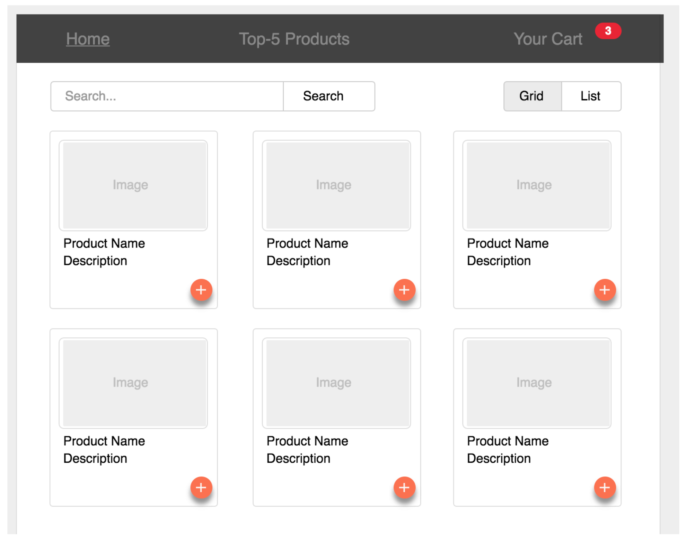
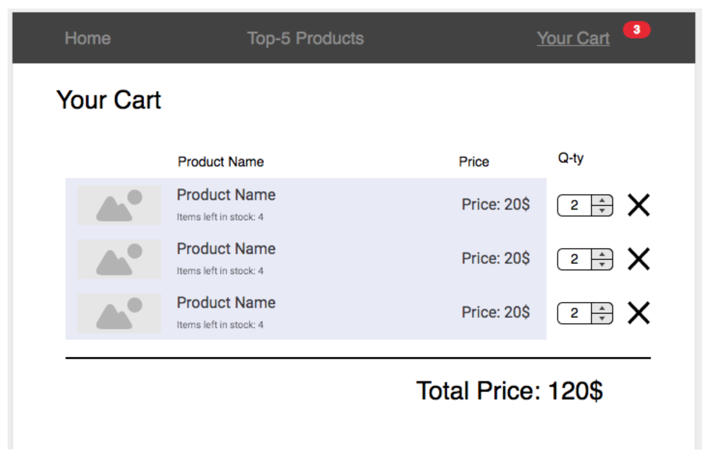

## Bem vindo
---
Obrigado por participar do desafio Frontend da Tembici! Estamos muito contentes pelo seu primeiro passo para fazer parte de um time excepcional.

# Criar um aplicativo de compras#

Criar um aplicativo de compras, consultar a [API](https://private-3efa8-products123.apiary-mock.com/products) para listar os produtos. Basear-se no mockup fornecido:

### **Deve conter** ###

- __Barra de navegação__ deve conter os seguintes links.
  * Todos os produtos, deve exibir a lista de todos os produtos
  * Top 5, deve exibir os 5 produtos mais visualizados
  * Carrinho de compras com a indicação de quantos produtos estão no carrinho, deve exibir a página do carrinho
- __Lista de produtos__. Exemplo de chamada na API: `https://private-3efa8-products123.apiary-mock.com/products`.
  * Suporte a paginação na tela de lista, com endless scroll / scroll infinito.
  * Cada produto deve exibir Imagem, Nome, Descrição, Itens restantes e preço
  * Ao tocar em um item, deve ser adicionado ao carrinho de compras
- __Carrinho__.
  * Deve exibir todos os produtos adicionados em uma exibição de lista
  * Deve permitir a alteração de quantidade de cada produto
  * Deve permitir a exclusão de um produto do carrinho
  * A cada alteração deve ser atualizado o valor total da compra

### **OBS** ###

A foto do mockup é meramente ilustrativa.

### **Processo de submissão** ###

O candidato deverá implementar a solução e enviar um pull request para este repositório com a solução.

O processo de Pull Request funciona da seguinte maneira:

1. Candidato fará um fork desse repositório (não irá clonar direto!)
2. Fará seu projeto nesse fork.
3. Commitará e subirá as alterações para o __SEU__ fork.
4. Pela interface do Bitbucket, irá enviar um Pull Request.

Se possível deixar o fork público para facilitar a inspeção do código.

### **ATENÇÃO** ###

Não se deve tentar fazer o PUSH diretamente para ESTE repositório!
